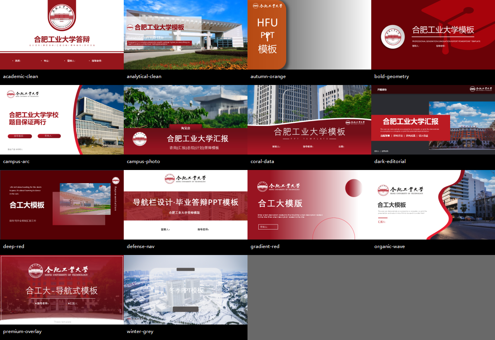

# 合工大三模板融合 PPT Skill

这是一个用于制作和改造合肥工业大学、宣城校区风格 PPTX 的 Codex Skill。

新版不再只依赖文字描述“做成红白合工大风格”，而是从用户提供的 `PPT模版.zip` 中整理出真实模板资产。每次制作 PPT 时，Skill 会根据主题、场景、内容密度和视觉偏好选择三套互补模板，抽取合适页面，再统一成一套完整的设计系统。



## 核心能力

- 从 14 套精选合工大模板中自动选择恰好 3 套。
- 生成每页对应的模板、资产页和原始页码计划。
- 从真实 PPTX 中复制可编辑页面，不靠截图或空白页仿制。
- 将三套模板分为视觉锚点、版式供体和强调供体。
- 统一校徽、校名、字体、颜色、标题、页眉页脚和页码。
- 汇报人、班级、专业、学院、学号和日期只按用户材料填写；未知时留空或删除。
- 支持课堂汇报、课程展示、论文答辩、项目报告、研究汇报和旧 PPT 改造。
- 支持校园摄影、数据分析、深色现代、秋季和冬季主题。
- 强制全量渲染检查，清理模板占位文字、二维码、测试数据和格式跳变。

## 三模板融合

三套模板不会平均拼接：

| 角色 | 建议影响比例 | 负责内容 |
| --- | ---: | --- |
| `visual_anchor` | 60% | 品牌、字体、颜色、封面、章节、页眉页脚 |
| `layout_donor` | 25% | 流程、对比、时间线、复杂图文布局 |
| `accent_donor` | 15% | 数据图、摄影裁切、季节氛围、强调页面 |

最终 PPT 只保留主模板的品牌和视觉语法。其他模板只贡献布局与表现方式，不保留第二套校徽、标题、页脚或配色。

详细规则见 [references/fusion-protocol.md](references/fusion-protocol.md)。

## 模板库

| ID | 风格 | 常用场景 |
| --- | --- | --- |
| `academic-clean` | 红白学术清爽 | 研究、论文、正式课程 |
| `dark-editorial` | 深灰红现代编辑 | 科技、项目、工程 |
| `campus-photo` | 校园摄影红白 | 学校介绍、图片叙事 |
| `bold-geometry` | 大红几何章节 | 答辩、正式发布 |
| `deep-red` | 深红沉浸极简 | 品牌感演讲、大屏展示 |
| `analytical-clean` | 白底分析图表 | 数据、市场、研究结果 |
| `defense-nav` | 导航式答辩 | 毕业答辩、项目审查 |
| `premium-overlay` | 校园叠色高级 | 领导汇报、高质量答辩 |
| `coral-data` | 珊瑚红轻信息图 | 青年课堂、数据讲解 |
| `campus-arc` | 校园弧形现代 | 课程汇报、学校主题 |
| `organic-wave` | 红色曲线活力 | 创意课程、校园活动 |
| `gradient-red` | 柔和红色渐变 | 通用课程、总结汇报 |
| `winter-grey` | 冬季灰绿雪景 | 冬季校园、沉静叙事 |
| `autumn-orange` | 秋季橙棕摄影 | 秋季校园、人文主题 |

每套模板保留 10 张高价值代表页，共 140 张可编辑源页。模板联系表位于 `assets/previews/`。

## 安装

克隆到 Codex skills 目录：

```powershell
git clone https://github.com/linmohan00-rgb/hfut-xuancheng-ppt-maker-skill.git `
  "$env:USERPROFILE\.codex\skills\hfut-xuancheng-ppt-maker"
```

新会话中通过 `$hfut-xuancheng-ppt-maker` 调用。

## 使用示例

```text
Use $hfut-xuancheng-ppt-maker 做一份 12 页的合工大课堂汇报，
主题是大学生压力调适，风格清爽、有校园图片和少量数据图，并附 7 分钟讲稿。
```

```text
Use $hfut-xuancheng-ppt-maker 把这份旧 PPT 改成合工大毕业答辩，
保留内容和数据，从三套模板中融合出一套正式、现代、可编辑的新稿。
```

```text
Use $hfut-xuancheng-ppt-maker 做一份秋季校园文化主题 PPT，
秋季模板只作为氛围供体，整体仍保持合工大红白品牌一致。
```

## 手动运行选择器

```powershell
python scripts/select_templates.py `
  --brief "合工大 论文答辩 正式 现代 数据图表 15页" `
  --slides 15 `
  --sections 4 `
  --output template-selection.json
```

强制包含或排除模板：

```powershell
python scripts/select_templates.py `
  --brief "冬季校园课程汇报" `
  --slides 12 `
  --include winter-grey `
  --exclude dark-editorial,deep-red `
  --output template-selection.json
```

## 生成融合起始稿

Windows 且安装 Microsoft PowerPoint 时：

```powershell
powershell -ExecutionPolicy Bypass -File scripts/build_fusion_starter.ps1 `
  -Plan template-selection.json `
  -Output fusion-starter.pptx
```

生成的 `fusion-starter.pptx` 包含来自三套模板的真实可编辑页面，并在每页 Tag 中记录模板 ID、资产页和原始页码。它是后续内容替换与格式统一的起始稿，不是可直接交付的完成稿。

## 验证

```powershell
python scripts/validate_template_bank.py
```

验证内容包括：

- PPTX ZIP 包完整性。
- 模板资产与预览是否存在。
- 每套模板页数与原始页码映射是否一致。
- 页面角色引用是否越界。

## 目录

```text
hfut-xuancheng-ppt-maker-skill/
├─ SKILL.md
├─ README.md
├─ agents/
│  └─ openai.yaml
├─ assets/
│  ├─ templates/          # 14 套裁剪后的可编辑 PPTX
│  └─ previews/           # 模板联系表与总览
├─ references/
│  ├─ fusion-protocol.md
│  ├─ ppt-production-standard.md
│  ├─ request-checklist.md
│  ├─ template-catalog.json
│  └─ template-catalog.md
└─ scripts/
   ├─ build_fusion_starter.ps1
   ├─ select_templates.py
   └─ validate_template_bank.py
```

## 模板来源与筛选

模板资产来自用户提供的 `PPT模版.zip`。原包包含 32 个 PPTX，本版本从 PowerPoint 可正常渲染的模板中选择 14 套互补风格，并为每套保留 10 张代表页。

原包中的 `合肥工业大学模板-15.pptx`、`-22.pptx`、`-25.pptx` 和 `-32.pptx` 虽然 ZIP 结构可读取，但 Microsoft PowerPoint 无法正常打开，因此未进入运行时模板库。这样可以避免自动制作过程中出现损坏或修复提示。
